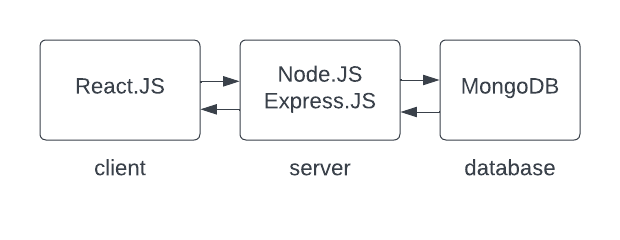

## Seminaarityö: Habit tracker -sovellus MERN-stackilla ja kontitus Dockerilla

### Johdanto

Seminaarityöni käsittelee habit tracker -sovelluksen kehittämistä MERN-stackilla ja sen paketoimista Docker-konttiin. Habit tracker on sovellus, joka auttaa käyttäjiä seuraamaan ja hallitsemaan heidän arkipäivän tapojaan ja rutiinejaan. Sovellukseen voi lisätä tapoja ja tavoiteaikataulun (target frequency) niille, merkitä tavan tehdyksi, muokata ja poistaa tapoja, ja sovellus näyttää kuinka monta kertaa peräkkäin tapa on suoritettu (current streak).

MERN-stack koostuu neljästä teknologiasta: MongoDB, Express.js, React ja Node.js. Seminaarityön tarkoituksena oli etenkin itselleni uuden MongoDB:n opetteleminen ja siihen tutustuminen. Valitsin kyseiset teknologiat, koska ne ovat yleisesti käytettyjä ja niiden avulla voidaan luoda tehokkaita ja skaalautuvia web-sovelluksia, joten koin voivani hyötyä niiden lisäopettelusta. Lisäksi sovellus on paketoitu Docker-konttiin. Paketoimalla sovellus Docker-konttiin se voidaan helposti siirtää ja suorittaa eri ympäristöissä ilman yhteensopivuusongelmia. Kontitus oli itselleni lähes uusi aihe, josta halusin oppia lisää. Koska konttiteknologiat ovat nykyään suosittuja, ajattelin, että käytännön kokeilusta voisi olla hyötyä. Erityisesti kontitus hyödyttäisi sovelluksen kasvaessa ja tarvitessa monimutkaisempia ympäristöjä.

### Käytetyt tekniikat

#### MongoDB

Sovelluksen tietokantana käytettiin MongoDB:ta, joka on dokumenttitietokanta. Tämä tietokantajärjestelmä on joustava ja skaalautuva, joten se sopii hyvin tällaisen sovelluksen toteuttamiseen.

MongoDB:n opettelu oli kiinnostavaa, mutta vaati myös perehtymistä, koska sen käyttö ja skeeman suunnittelu eroavat perinteisestä relaatiotietokannan suunnittelusta. MongoDB käyttää JSON-muotoista tiedon tallennusta, mikä tuntui toisaalta selkeältä. Dokumenttimallin ansiosta tiedon tallennus ja käsittely on joustavaa, mikä mahdollistaa nopean kehityksen ja skaalautuvan sovellusarkkitehtuurin.

Toteuttamani sovellus oli pieni, ja MongoDB:n hyödyt tulisivat varmasti vielä paremmin esiin sovellusta laajennettaessa, esimerkiksi lisäämällä käyttäjienhallinnan tai muistutusominaisuuden.

#### Mongoose

Mongoose on object document mapper (ODM), ja sen avulla JavaScript-olioiden tallettaminen MongoDB:n dokumenteiksi on suoraviivaista. Mongoose tarjoaa yksinkertaistetun käyttöliittymän MongoDB-tietokantaan. Lisäksi Mongoosen avulla voidaan määritellä MongoDB-tietokannan skeema, joka määrittelee, miten tietokantaan tallennetut dokumentit ovat rakennettuja.

#### Express

Express on web-sovelluskehys, jota käytettiin sovelluksen backendin toteuttamiseen. Se tarjoaa paljon hyödyllisiä toimintoja, kuten reitityksen ja middlewaren käytön.

#### Node.js

Node.js on suoritusympäristö JavaScriptille, jota käytettiin sovelluksen backendin toteuttamiseen.

#### React

React on JavaScript-kirjasto, jota käytettiin sovelluksen frontendin toteuttamiseen. Sen käyttöliittymän rakentaminen perustuu komponentteihin.

#### styled-components

Sovelluksen ulkoasu on toteutettu käyttämällä React-kirjastoa Styled-components, joka mahdollistaa tyylien määrittämisen React-komponenttien yhteydessä. Tällöin tyylit ovat sidottu suoraan komponentteihin, jolloin komponentin tilaa voidaan käyttää tyylien dynaamiseen muokkaamiseen. Tämä oli myös itselleni uusi kirjasto, mutta sen käyttö tuntui tekevän tyylien hallinnasta helpompaa ja joustavampaa, koska tyyli- ja toiminnallisuuslogiikkaa voidaan yhdistää yhdeksi kokonaisuudeksi.

#### Docker

Dockeria käytettiin sovelluksen paketointiin ja kontittamiseen. Docker on konttiteknologia, joka mahdollistaa sovellusten pakkaamisen ja suorittamisen eristetyssä ympäristössä. MERN-stackilla toteutetun sovelluksen kontittaminen tapahtui kirjoittamalla Dockerfilet clientille ja serverille, joiden perusteella kontit luodaan. MongoDB-tietokannalle löytyi Dockerista valmis image. Lisäksi tehtiin docker-compose.yml-tiedosto, joka määrittelee MERN-stack-sovelluksen client-, server- ja database-palvelut, määrittelee niiden väliset riippuvuudet, ympäristömuuttujat, verkot ja käynnistyskomennot. Kun Docker Compose -tiedosto on luotu, sovelluksen käyttöönotto tapahtuu komennolla "docker-compose up". Tämä käynnistää kaikki tarvittavat Docker-kontit ja tekee sovelluksen käyttövalmiiksi.

Dockerin opettelu jäi lopulta melko pienehköön rooliin seminaarityössä, ja jatkossa olisi kiinnostavaa opetella lisää konteista ja esimerkiksi konttien julkaisemisesta.

#### Arkkitehtuurikaavio

### Kehitysehdotuksia

Habit tracker -sovellusta voisi jatkokehittää monella tapaa. Tällä hetkellä sovellus on yksinkertaistettu, joten esimerkiksi seuraavia ominaisuuksia voisi lisätä:
- Tarkistus, onko henkilö jo päivän aikana merkinnyt tavan suoritetuksi
- currentStreak nollautuminen, jos päivän aikana ei suoriteta (sovelluksen päivitys esim. keskiyöllä, apuna esimerkiksi [node-cron](https://www.npmjs.com/package/node-cron))
- targetFrequency vaihtoehdoiksi mahdollisuus valita esimerkiksi kuinka monta kertaa päivässä, viikossa tai muuna ajanjaksona (tämän vaikutus tietokantaan, esim. targetFrequencyyn dailycounter ja weeklycounter)
- käyttäjät, kirjautuminen, autentikointi ja auktorisointi
- tapojen järjestyksen muuttaminen

### Lähteet

Apuna seminaarityön tekemisessä on käytetty etenkin HY:n kurssin Full Stack Open [materiaalia](https://fullstackopen.com/osa3/tietojen_tallettaminen_mongo_db_tietokantaan), [MongoDB dokumentaatiota](https://www.mongodb.com/docs/), [Docker dokumentaatiota](https://docs.docker.com/) sekä [styled-components dokumentaatiota](https://styled-components.com/docs).
